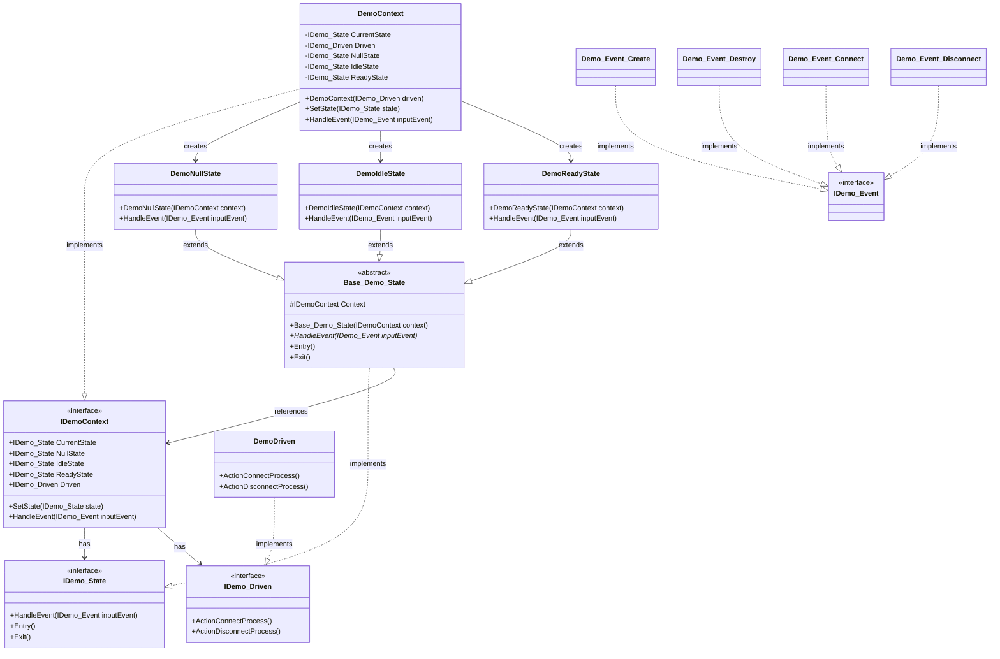

```mermaid
classDiagram
    class IDemoContext {
        <<interface>>
        +IDemo_State CurrentState
        +IDemo_State NullState
        +IDemo_State IdleState
        +IDemo_State ReadyState
        +IDemo_Driven Driven
        +SetState(IDemo_State state)
        +HandleEvent(IDemo_Event inputEvent)
    }

    class DemoContext {
        -IDemo_State CurrentState
        -IDemo_Driven Driven
        -IDemo_State NullState
        -IDemo_State IdleState
        -IDemo_State ReadyState
        +DemoContext(IDemo_Driven driven)
        +SetState(IDemo_State state)
        +HandleEvent(IDemo_Event inputEvent)
    }

    class IDemo_State {
        <<interface>>
        +HandleEvent(IDemo_Event inputEvent)
        +Entry()
        +Exit()
    }

    class Base_Demo_State {
        <<abstract>>
        #IDemoContext Context
        +Base_Demo_State(IDemoContext context)
        +HandleEvent(IDemo_Event inputEvent)*
        +Entry()
        +Exit()
    }

    class DemoNullState {
        +DemoNullState(IDemoContext context)
        +HandleEvent(IDemo_Event inputEvent)
    }

    class DemoIdleState {
        +DemoIdleState(IDemoContext context)
        +HandleEvent(IDemo_Event inputEvent)
    }

    class DemoReadyState {
        +DemoReadyState(IDemoContext context)
        +HandleEvent(IDemo_Event inputEvent)
    }

    class IDemo_Driven {
        <<interface>>
        +ActionConnectProcess()
        +ActionDisconnectProcess()
    }

    class DemoDriven {
        +ActionConnectProcess()
        +ActionDisconnectProcess()
    }

    class IDemo_Event {
        <<interface>>
    }

    class Demo_Event_Create {
    }

    class Demo_Event_Destroy {
    }

    class Demo_Event_Connect {
    }

    class Demo_Event_Disconnect {
    }

    DemoContext ..|> IDemoContext : implements
    Base_Demo_State ..|> IDemo_State : implements
    DemoNullState --|> Base_Demo_State : extends
    DemoIdleState --|> Base_Demo_State : extends
    DemoReadyState --|> Base_Demo_State : extends
    DemoDriven ..|> IDemo_Driven : implements
    
    Demo_Event_Create ..|> IDemo_Event : implements
    Demo_Event_Destroy ..|> IDemo_Event : implements
    Demo_Event_Connect ..|> IDemo_Event : implements
    Demo_Event_Disconnect ..|> IDemo_Event : implements

    IDemoContext --> IDemo_State : has
    IDemoContext --> IDemo_Driven : has
    Base_Demo_State --> IDemoContext : references
    DemoContext --> DemoNullState : creates
    DemoContext --> DemoIdleState : creates
    DemoContext --> DemoReadyState : creates
```