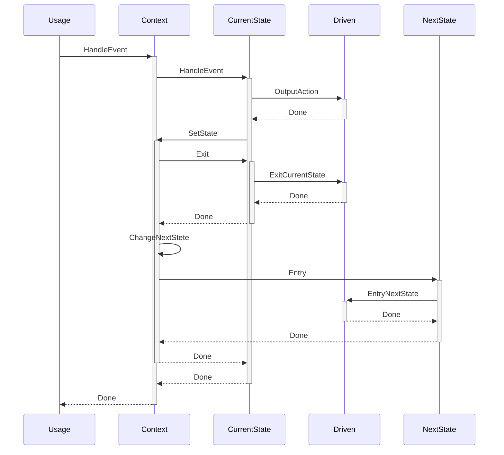

```mermaid
sequenceDiagram
    Usage        ->>+  Context      : HandleEvent
    Context      ->>+  CurrentState : HandleEvent
    CurrentState ->>+  Driven       : OutputAction
    Driven       -->>- CurrentState : Done
    CurrentState ->>+  Context      : SetState
    Context      ->>+  CurrentState : Exit
    CurrentState ->>+  Driven       : ExitCurrentState
    Driven       -->>- CurrentState : Done
    CurrentState -->>- Context      : Done
    Context      ->>   Context      : ChangeNextStete
    Context      ->>+  NextState    : Entry
    NextState    ->>+  Driven       : EntryNextState
    Driven       -->>- NextState    : Done
    NextState    -->>- Context      : Done
    Context      -->>- CurrentState : Done
    CurrentState -->>- Context      : Done
    Context      -->>- Usage        : Done
```